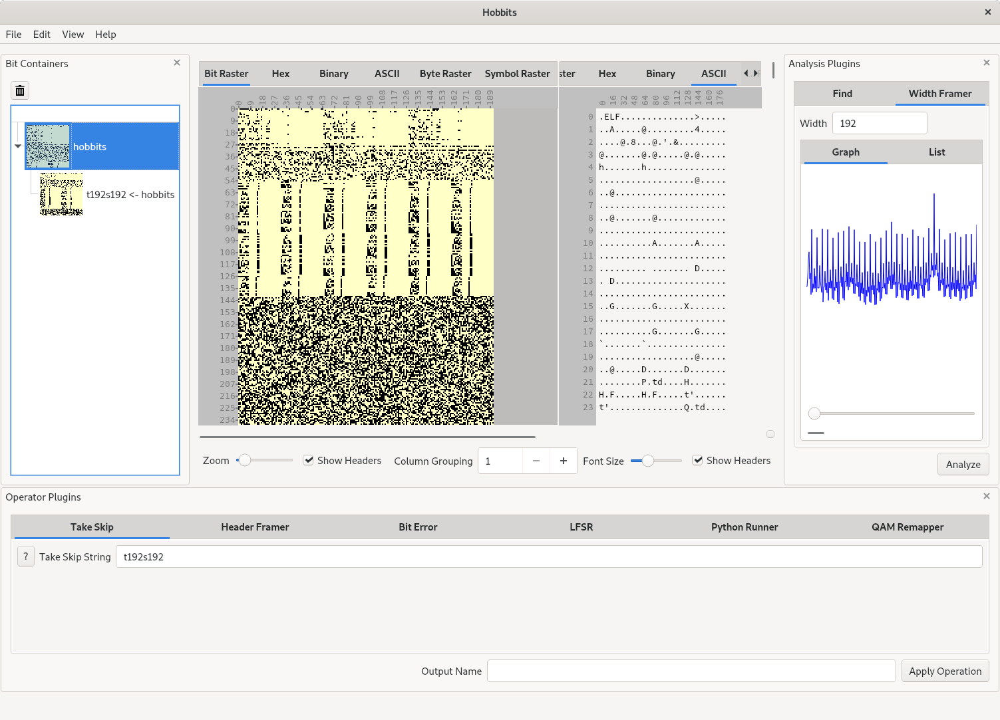

## Building with Qt Creator and Qt 5.13+
1. (Optional) Install any dev libraries required to get the full functionality
of the core plugins ([fftw3](http://www.fftw.org/download.html))
2. Open the root project file, [src/hobbits.pro](src/hobbits.pro), in Qt Creator
3. Build and run the application

## Using Hobbits
Read the user guide in the documentation and/or watch
[this walkthrough video](https://youtu.be/6ygkhze36qM)

## Adding plugins
1. Read the plugin developer guide in the documentation and/or watch
[this plugin tutorial video](https://youtu.be/Dg3vknwLO74)
2. Run [wizard_installer.sh](wizards/wizard_installer.sh) from inside the
[wizards](wizards) directory to add Hobbits Plugin Qt Creator templates (restart
Qt Creator after doing this)
3. Add a plugin subproject to the appropriate plugins project and implement your
desired functionality

## Viewing and Building the Documentation
1. Install the Python module `mkdocs`
2. Run `mkdocs serve` in the project root directory to serve the documentation
at `localhost:8000`
3. Run `mkdocs build` to build the documentation into static website files

