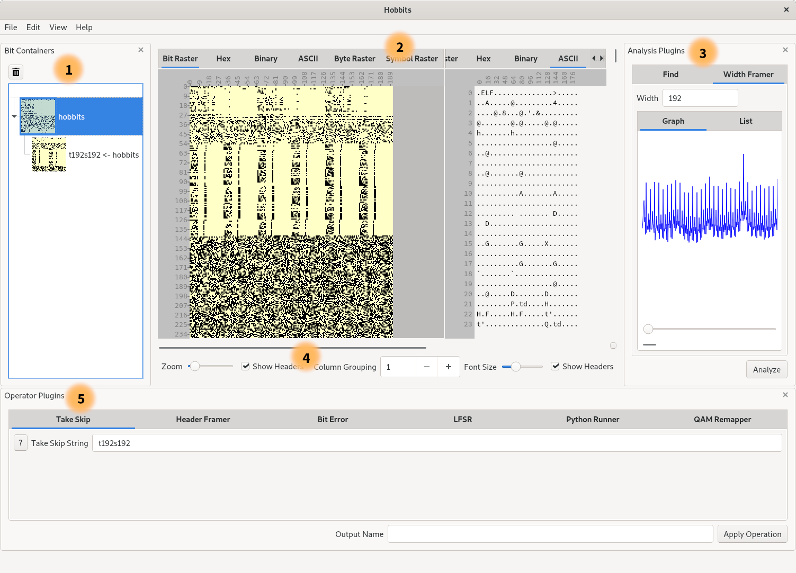

# Using the Hobbits GUI

The Hobbits GUI is a powerful tool for manually evaluating data. It provides a
fully integrated set of tools for preprocessing, analyzing, and displaying data
in a variety of ways. This guide explains how to use the different features of
the Hobbits GUI, and then presents a few example workflows.

## GUI Layout

 1. Bit Container Selection Panel
 2. Displays
 3. Analyzer Panel
 4. Controls for the Displays
 5. Operator Panel

## Bit Containers

Hobbits organizes imported data into "bit containers" that appear in a 
collapsible panel on the left side of the GUI by default. The panel's visibility
can be toggled via:

  - The top menu at `View->Bit Containers`
  - The `Ctrl-Shift-B` hotkey
  - The `x` at the top right corner of the panel (only for hiding)

Bit containers keep track of the data as well as metadata that can be extended,
modified, and read by plugins. An important part of this metadata is the
"frames" that the data is subdivided into. For example, when looking at
time-division multiplexed data in a bit raster, it is useful to have each
multiplexer frame on its own line so that constants, counters, and other
patterns can be easily identified.

## Displays

One of the most prominent features of the GUI is the variety of displays that it
provides for looking at data. Switching between displays is as simple as
selecting the tab of the display that you want to use.

Your position in the data is preserved across displays, so you can navigate to a
section of your data in one display, and then switch tabs to see what that
section looks like in a different display.

Displays can also be split so that you can look at more than one display at the
same time. Split views can be added or removed via:

 - The top menu in `View->Split View`
 - The `Ctrl-Shift-V` hotkey adds a view to the right
 - The `Ctrl-Shift-X` hotkey removes the rightmost view

## Operators

Operators are displayed in a collapsible panel that appears at the bottom of the
GUI by default. The panel's visibility can be toggled via:

 - The top menu at `View->Operator Plugins`
 - The `Ctrl-Shift-O` hotkey
 - The `x` at the top right corner of the panel (only for hiding)

Operators can be used to modify, generate, combine, or separate data. A commonly
used operator is the Take Skip Operator, which allows you to quickly process
data with a simple filtering expression. For example, if you have data that is
uninteresting for the first 50 bits of every 256-bit frame, you can perform a
`s50t206` to skip 50 bits and then take 206 bits for each frame so that you are
only left with the last 206 bits of each frame for further evaluation.

When an operator modifies data, the original data is still available to work
with.

## Analyzers

Analyzers appear in a collapsible panel on the right side of the GUI by default.
The panel's visibility can be toggled via:

 - The top menu at `View->Analyzer Plugins`
 - The `Ctrl-A` hotkey
 - The `x` at the top right corner of the panel (only for hiding)

Analyzers provide useful information about the data, and can add that
information to the current bit container's metadata. For example, you can use
the Width Framer to discover appropriate frame widths for data, and then apply
one of those widths to the container. You can use the Find analyzer to find
instances of bit/byte/ASCII sequences in data, and then highlight and quickly
navigate to them.

## Command line execution

When running Hobbits from the command line, a variety of configuration and
data loading options are provided. Simply run it with the `--help` option to see
which options are available.

## Plugin loading

A standard Hobbits distributable binary comes with a set of core plugins that
should load without any user configuration. However, if you want to use a
plugin that is not part of the core distribution, you can either:

 - add it to the appropriate directory in the `plugins` folder of the
   distribution folder or `~/.local/share/hobbits/plugins`
- or, use the `--extra-plugin-path` command line option to specify a folder with
  non-core plugins in it (remember that a valid plugins folder has analyzers,
  displays, and operators in their own sub-folders, e.g. `my-plugins/displays`.)
- or, specify your plugin path in your GUI config. In Linux, the config is an
  ini file that can be found at `~/.config/Hobbits/Hobbits GUI.conf`, and the
  plugin path configuration is the `path` variable in the `[Plugins]` section.